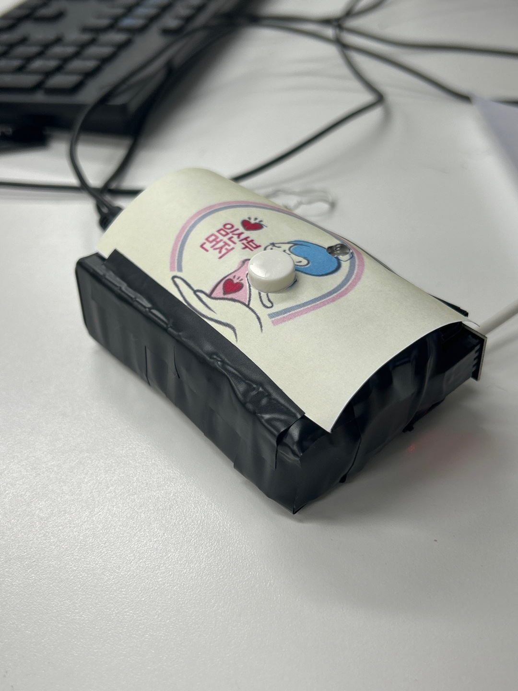
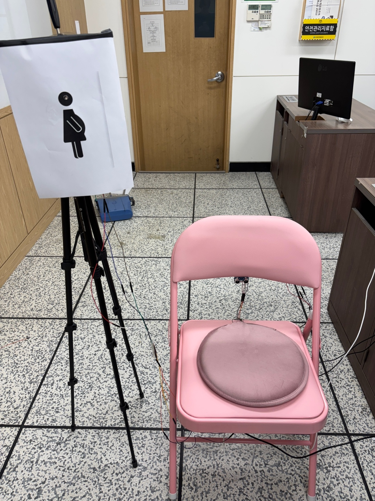

# 🌟 스마트 임산부석 관리 시스템 🌟

본 프로젝트는 **초음파 센서**, **RF24 무선 통신** 및 다양한 모듈을 활용하여 대중교통 및 공공장소에서 **임산부 전용 좌석**의 상태를 관리하는 스마트 시스템을 개발합니다.  
좌석의 점유 상태를 실시간으로 확인하고, 직관적인 알림과 제어를 통해 더욱 안전하고 편리한 환경을 제공합니다.  

---

## 🛠️ 주요 기능

### ✅ **실시간 좌석 상태 모니터링**  
- 초음파 센서를 이용해 좌석의 사용 가능 여부를 실시간으로 감지.

### ✅ **무선 신호 전송 및 제어**  
- NRF24L01 모듈을 통해 송신부와 수신부 간 원활한 통신 지원.

### ✅ **동적 장치 관리**  
- 좌석 점유 상태와 RF 신호에 따라 **LED**, **부저**, **진동 모터**를 제어.

### ✅ **상태 기반 시스템 제어**  
- 상태 머신(State Machine)으로 세부적인 동작 관리.  
  - `STATE_IDLE`: 대기 상태  
  - `STATE_ACTIVE`: 좌석 활성 상태  
  - `STATE_LED_ONLY`: LED 활성화 상태  

---

## 🖼️ 시스템 구성

### 🎛️ **송신부**
- **구성 요소**  
  - 버튼  
  - NRF24L01 무선 통신 모듈  
  - LED  
  - AMS1117 3.3V 레귤레이터  

- **기능**  
  - 버튼 입력으로 `1`(활성화), `0`(비활성화) 신호 전송  
  - LED를 통해 신호 전송 상태 표시  

---

### 🎛️ **수신부**
- **구성 요소**  
  - NRF24L01 무선 통신 모듈  
  - 초음파 센서  
  - LED, 부저, 진동 모터  
  - AMS1117 3.3V 레귤레이터  

- **기능**  
  - RF 신호를 수신하고 좌석 상태를 관리  
  - 초음파 센서로 좌석 점유 상태 감지  
  - 신호 및 점유 상태에 따라 장치를 제어  

---

## ⚙️ 시스템 블록도

---

## 🛠️ 하드웨어 구성

| 구성 요소         | 역할                                                        |
|-------------------|------------------------------------------------------------|
| **라즈베리파이**  | 시스템 제어 및 수신부 코드를 실행                           |
| **NRF24L01 모듈** | 송신부와 수신부 간 무선 통신 지원                          |
| **AMS1117 3.3V**  | NRF24L01 모듈에 안정적인 전력 공급                         |
| **초음파 센서**   | 주변 물체와의 거리 측정을 통해 좌석 점유 상태 확인          |
| **LED**           | 좌석 상태를 시각적으로 표시                                 |
| **부저**          | 활성화 상태를 청각적으로 알림                              |
| **진동 모터**     | 특정 조건에서 진동 피드백 제공                              |

---

## 🖥️ 소프트웨어 개요

- **프로그래밍 언어**: C/C++  
  - WiringPi 및 RF24 라이브러리를 활용하여 라즈베리파이에서 실행.

- **RF 통신**: NRF24L01 모듈을 통해 송신 및 수신 데이터를 처리.

- **상태 머신 구현**:  
  `STATE_IDLE`, `STATE_ACTIVE`, `STATE_LED_ONLY` 상태를 기반으로 각 상황에서 적절한 장치 제어.

---

## 📋 실행 방법

1. **하드웨어 구성**  
   - 송신부와 수신부에 각 구성 요소를 배치하고 연결.  
   - 라즈베리파이에 WiringPi와 RF24 라이브러리를 설치.

2. **코드 실행**  
   - 송신부: `sender.c` 실행  
   - 수신부: `receiver.c` 실행

3. **테스트 및 디버깅**  
   - 초음파 센서를 이용해 거리 기반 좌석 점유 상태 확인.  
   - 송신 신호와 수신 동작이 정상적으로 수행되는지 테스트.

---

## 📂 프로젝트 구성 파일

- `sender.c`: 송신부 코드  
- `receiver.c`: 수신부 코드  
- `README.md`: 프로젝트 개요 및 설명  
- `assets/`: 하드웨어 구성 이미지  

---

## 📚 참고 자료

- NRF24L01 무선 통신 모듈 문서  
- 라즈베리파이 공식 문서  
- WiringPi 및 SoftTone 라이브러리 문서  

---
